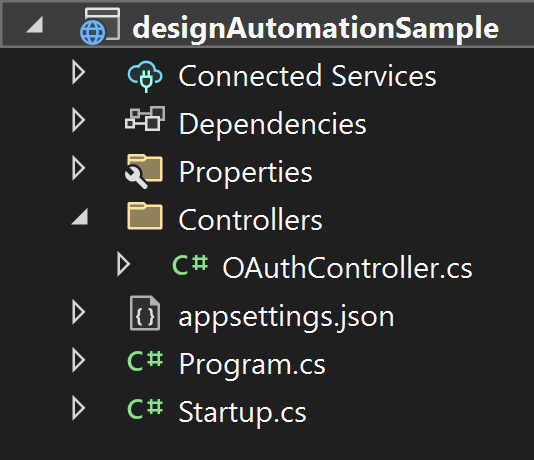
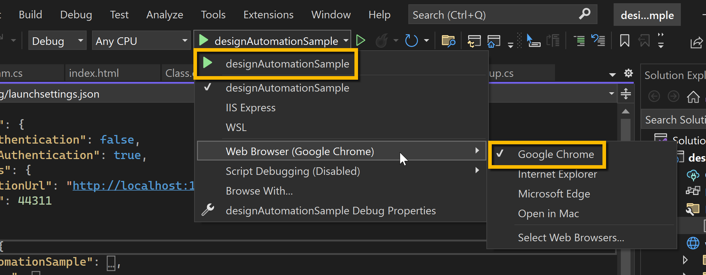
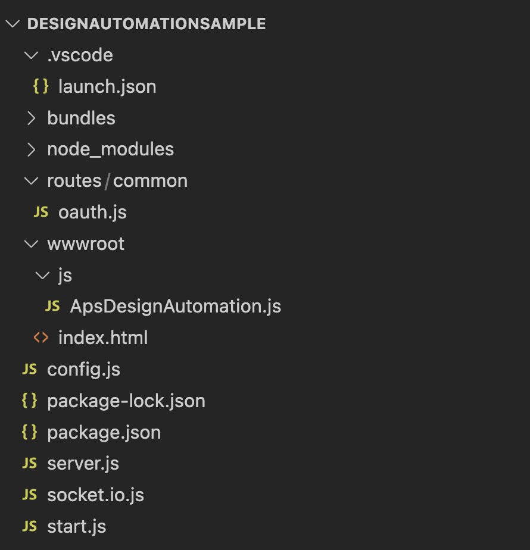

# 設計の自動化

- [設計の自動化](https://tutorials.autodesk.io/tutorials/design-automation)
- [Design Automation API サンプル](https://adndevblog.typepad.com/technology_perspective/2022/08/design-automation-api-sample.html)

## 紹介
このチュートリアルでは、入力ファイルをアップロードし、その and パラメーターを変更して、出力ファイルを保存できる Web アプリを作成する方法について説明します。UI では、AppBundle と Activity を (初期設定として) 定義し、Workitems を実行し、結果を出力することができます。`width` `height`

> 入力ファイルと出力ファイルはどちらも OSS バケットに保存され、Simple Viewer チュートリアルを使用して表示できます。


モデルを変更するには、次の手順が必要です。
サーバーを作成する << 初めての開発者ですか?ここから始める必要があります

- 基本的なアプリ UI
- プラグインを準備する
- アクティビティの定義
- 作業項目の実行

> **先端** このサンプルの完全な実装は、GitHub で入手できます。
>
> Node.jsの場合:https://github.com/autodesk-platform-services/aps-design-automation-nodejs
>
> .NET の場合: https://github.com/autodesk-platform-services/aps-design-automation-dotnet

## サーバーの作成

あなたの&は保護され、すべてのファイルがあなたのアカウントにバインドされるため、機密性を保つ必要があります。Web アプリケーションの場合は、サーバー上に保持します。このセクションでは、ローカル開発サーバーを準備する方法、作成方法について説明します。`Client ID` `Secret`

必要なソフトウェアについては、「環境設定」セクションを確認してください。

### プロジェクトのセットアップ

- Visual Studio 2022 を起動し、`Create New Project`
- テンプレート検索バーに入力します。[次へ] を選択して選択します。`ASP.NET Core Empty`
- 次のダイアログで、名前を付けましょう 、次へ。`designAutomationSample`
- 次のダイアログで、[.NET 6.0 (Long Term Support)] が選択されていることを確認し、チェックを外します。`Configure for HTTPS`
- チェックボックスをオンにして最上位レベルのステートメントの使用を無効にし、 をクリックします。`Do not use top-level statementscreate`
- Autodesk Forge NuGet パッケージをインストールするには、プロジェクト(ソリューション エクスプローラ)を右クリックし、[NuGet パッケージを管理]を選択して、[参照]で Autodesk.Forge を検索し、Autodesk.Forge をインストールします。これは、入力と出力の結果を OSS バケットにアップロードするために使用されます。
- 次のパッケージの .NET 6 互換バージョンもインストールしてください。

> **手記** 
> 
> このドキュメントの執筆時点では、チュートリアルではパッケージ名の横に指定されたバージョンを使用しています

```
Autodesk.Forge v1.9.7
Autodesk.Forge.DesignAutomation v5.1.1
Microsoft.AspNetCore.Mvc.NewtonsoftJson v6.0.16
Microsoft.AspNetCore.SignalR.Protocols.NewtonsoftJson v6.0.16
```


### アプリケーション構成
ソリューション エクスプローラーで、 の下にある [プロジェクト] を選択します。 を選択して開きます。`designAutomationSample` `Properties` `launchSettings.json`

- `applicationUrl`を「http://localhost:8080」に変更します
- go内で次の環境を追加します。`launchSettings.json` `profiles\designAutomationSample\environmentVariables`

```
ASPNETCORE_URLS:"http://localhost:8080"
APS_CLIENT_ID:"Your Id Here"
APS_CLIENT_SECRET:"Your Secret Here"
```

- プロジェクトを選択し、右クリックして > を選択し、 を選択します。`designAutomationSample` `Add` `New Item` `JSON`
- 名前を `.appsettings.user.json`
- [DesignAutomation SDK](https://www.nuget.org/packages/Autodesk.Forge.DesignAutomation) が oAuth を作成し、API リクエストを実行するために必要である、以下の設定を追加します。

```c#:appsettings.user.json
{
  "Forge": {
    "ClientId": "your client id",
    "ClientSecret": "your secret"
  }
}
```

これはローカルで実行されているため、0に設定されます。以下のようになります。`sslPort`

```c#:launchSettings.json
{
  "iisSettings": {
    "windowsAuthentication": false,
    "anonymousAuthentication": true,
    "iisExpress": {
      "applicationUrl": "http://localhost:8080",
      "sslPort": 0
    }
  },
  "profiles": {
    "designAutomationSample": {
      "commandName": "Project",
      "dotnetRunMessages": true,
      "launchBrowser": true,
      "applicationUrl": "http://localhost:8080",
      "environmentVariables": {
        "ASPNETCORE_ENVIRONMENT": "Development",
        "APS_CLIENT_ID": "your client id here",
        "APS_CLIENT_SECRET": "your secret here"
      }
    },
    "IIS Express": {
      "commandName": "IISExpress",
      "launchBrowser": true,
      "environmentVariables": {
        "ASPNETCORE_ENVIRONMENT": "Development"
      }
    }
  }
}
```
### サーバーのセットアップ

次に、Program.csを開き、次の名前空間を追加します

```c#
using Autodesk.Forge.Core;
using Autodesk.Forge.DesignAutomation;

```

次に、コンテンツを次のように置き換えます。これにより、上記で定義した環境変数から Forge Client ID と Secret をロードするようにアプリケーションに指示します。`Program.cs`

```c#
using Autodesk.Forge.Core;
using Autodesk.Forge.DesignAutomation;
using Microsoft.AspNetCore;

namespace designAutomationSample
{
    public class Program
    {
        public static void Main(string[] args)
        {
            CreateHostBuilder(args).ConfigureAppConfiguration(builder =>
            {
                builder.AddJsonFile($"appsettings.user.json", optional: true);
                builder.AddEnvironmentVariables();

            }).ConfigureServices((hostContext, services) =>
            {
                services.AddDesignAutomation(hostContext.Configuration);
            }).Build().Run();
        }

        public static IWebHostBuilder CreateHostBuilder(string[] args) =>
            WebHost.CreateDefaultBuilder(args)
                .UseStartup<Startup>();
    }
}
```

次に、Startup.csを開き(必要に応じて作成し)、次の名前空間を追加します

```c#
using Microsoft.AspNetCore.Mvc;

```

次に、Startup クラスの内容を次のコードに置き換えて、クライアントへの通知のプッシュに使用される静的ファイル サーバー (HTML と JS) と SignalR を有効にします。

```c#
// This method gets called by the runtime. Use this method to add services to the container.
// For more information on how to configure your application, visit https://go.microsoft.com/fwlink/?LinkID=398940
public void ConfigureServices(IServiceCollection services)
{
    services.AddMvc(options => options.EnableEndpointRouting = false).SetCompatibilityVersion(CompatibilityVersion.Version_3_0).AddNewtonsoftJson();
    services.AddSignalR().AddNewtonsoftJsonProtocol(opt=> {
        opt.PayloadSerializerSettings.ReferenceLoopHandling = Newtonsoft.Json.ReferenceLoopHandling.Ignore;
    });
}

// This method gets called by the runtime. Use this method to configure the HTTP request pipeline.
public void Configure(IApplicationBuilder app, IWebHostEnvironment env)
{
    app.UseFileServer();
    app.UseMvc();
}
```

### OAuthController.cs

WebAPI コントローラーをホストする Controllers フォルダーを作成します。 入力ファイルと出力ファイルを OSS バケットに読み書きする必要があります。[Controllers] フォルダーで、次の内容のファイルを作成します。`access token` `OAuthController.cs`

```c#:OAuthController.cs
using System;
using System.Collections.Generic;
using System.Linq;
using System.Threading.Tasks;
using Microsoft.AspNetCore.Mvc;
using Autodesk.Forge;

namespace designAutomationSample.Controllers
{
    [ApiController]
    public class OAuthController : ControllerBase
    {
        // As both internal & public tokens are used for all visitors
        // we don't need to request a new token on every request, so let's
        // cache them using static variables. Note we still need to refresh
        // them after the expires_in time (in seconds)
        private static dynamic InternalToken { get; set; }

        /// <summary>
        /// Get access token with internal (write) scope
        /// </summary>
        public static async Task<dynamic> GetInternalAsync()
        {
            if (InternalToken == null || InternalToken.ExpiresAt < DateTime.UtcNow)
            {
                InternalToken = await Get2LeggedTokenAsync(new Scope[] { Scope.BucketCreate, Scope.BucketRead, Scope.BucketDelete, Scope.DataRead, Scope.DataWrite, Scope.DataCreate, Scope.CodeAll });
                InternalToken.ExpiresAt = DateTime.UtcNow.AddSeconds(InternalToken.expires_in);
            }

            return InternalToken;
        }

        /// <summary>
        /// Get the access token from Autodesk
        /// </summary>
        private static async Task<dynamic> Get2LeggedTokenAsync(Scope[] scopes)
        {
            TwoLeggedApi oauth = new TwoLeggedApi();
            string grantType = "client_credentials";
            dynamic bearer = await oauth.AuthenticateAsync(
              GetAppSetting("APS_CLIENT_ID"),
              GetAppSetting("APS_CLIENT_SECRET"),
              grantType,
              scopes);
            return bearer;
        }

        /// <summary>
        /// Reads appsettings from web.config
        /// </summary>
        public static string GetAppSetting(string settingKey)
        {
            return Environment.GetEnvironmentVariable(settingKey).Trim();
        }
    }
}
```

プロジェクトの準備ができました!この時点で、次のようになります。



## 基本的なUI

インターフェイスは、バニラ HTML5 と に基づいています。基本的にはどのサーバー側でも同じですが、いくつかの違いがあります。 Websocketの実装では、socket.io()またはSignalR()を使用します。 UI ( と ) ファイルから始めましょう。フォルダーの下に、次の内容のファイルを作成します。`JavaScript` `Node.js` `.NET 6` `HTML` `JavaScript` `wwwroot` `index.html`

```html:index.html
<!DOCTYPE html>
<html>
  <head>
    <title>APS - Design Automation</title>
    <meta charset="utf-8" />
    <link rel="shortcut icon" href="https://cdn.autodesk.io/favicon.ico" />
    <!-- Common packages: jQuery, Bootstrap -->
    <script src="//cdnjs.cloudflare.com/ajax/libs/jquery/3.3.1/jquery.min.js"></script>
    <script src="//cdnjs.cloudflare.com/ajax/libs/twitter-bootstrap/3.4.1/js/bootstrap.min.js"></script>
    <link
      rel="stylesheet"
      href="//cdnjs.cloudflare.com/ajax/libs/twitter-bootstrap/3.4.1/css/bootstrap.min.css"
    />
    <!-- .NET SignalR -->
    <script src="https://cdnjs.cloudflare.com/ajax/libs/microsoft-signalr/3.1.7/signalr.min.js"></script>
    <!-- Files for this project -->
    <script src="/js/ApsDesignAutomation.js"></script>
  </head>

  <body style="height: 100%;">
    <!-- Fixed navbar by Bootstrap: https://getbootstrap.com/examples/navbar-fixed-top/ -->
    <nav class="navbar navbar-default navbar-fixed-top">
      <div class="container-fluid">
        <ul class="nav navbar-nav left">
          <li>
            <a href="http://tutorials.autodesk.io" target="_blank">
              
            </a>
          </li>
        </ul>
        <div style="float: right; margin-top: 15px; cursor: pointer;">
          <span
            style="padding-right: 5px;"
            data-toggle="modal"
            data-target="#defineActivityModal"
            title="Configura AppBundle & Activity"
          >
            <span class="glyphicon glyphicon-cog glyphiconTop mlink"> </span>
            Configure
          </span>
        </div>
      </div>
    </nav>
    <!-- End of navbar -->
    <div class="container-fluid" style="margin-top: 70px;">
      <div class="row">
        <div class="col-sm-4">
          <div class="form-group">
            <label for="width">Width:</label>
            <input
              type="number"
              class="form-control"
              id="width"
              placeholder="Enter new width value"
            />
          </div>
          <div class="form-group">
            <label for="height">Height:</label>
            <input
              type="number"
              class="form-control"
              id="height"
              placeholder="Enter new height value"
            />
          </div>

          <div class="form-group">
            <label for="inputFile">Input file</label>
            <input type="file" class="form-control-file" id="inputFile" />
          </div>
          <div class="form-group">
            <label for="activity">Existing activities</label>
            <select class="form-control" id="activity"></select>
          </div>
          <center>
            <button class="btn btn-primary" id="startWorkitem">
              Start workitem
            </button>
          </center>
          <br />
        </div>
        <div class="col-sm-8">
          <pre
            id="outputlog"
            style="height: calc(100vh - 120px);; overflow-y: scroll;"
          ></pre>
        </div>
      </div>
    </div>
    <!-- Modal Define AppBundle & Activity -->
    <div
      class="modal fade"
      id="defineActivityModal"
      tabindex="-1"
      role="dialog"
      aria-labelledby="myModalLabel"
    >
      <div class="modal-dialog" role="document">
        <div class="modal-content">
          <div class="modal-header">
            <button
              type="button"
              class="close"
              data-dismiss="modal"
              aria-label="Cancel"
            >
              <span aria-hidden="true">&times;</span>
            </button>
            <h4 class="modal-title" id="myModalLabel">
              Create/Update AppBundle & Activity
            </h4>
          </div>
          <div class="modal-body">
            <div class="alert alert-warning">
              <center>
                You just need to define AppBundle &amp; Activity once.<br />If
                the plugin code changed, redefine (creates a new version).
              </center>
            </div>
            <div class="form-group">
              <label for="localBundles">Select a local AppBundle:</label>
              <select class="form-control" id="localBundles"></select>
              <b>Tip:</b> Make sure .ZIP bundles are placed at
              <b>/bundles/</b> folder
            </div>
            <div class="form-group">
              <label for="engines">Select engine:</label>
              <select class="form-control" id="engines"></select>
            </div>
            For this sample the .ZIP name is used as suffix to define
            <b>AppBundle</b> and <b>Activity</b>
            names. Activities will have file and params input, and file output.
          </div>
          <div class="modal-footer">
            <button class="btn btn-danger" id="clearAccount">
              Clear account
            </button>
            <button
              type="button"
              class="btn btn-primary"
              id="createAppBundleActivity"
            >
              Create/Update
            </button>
          </div>
        </div>
      </div>
    </div>
  </body>
</html>
```

### ApsDesignAutomation.js

フォルダの下にフォルダを作成します。次に、フォルダー内に、次の内容のファイルを作成します。`js` `wwwroot` `wwwroot/js` `ApsDesignAutomation.js`

```js:ApsDesignAutomation.js
$(document).ready(function () {
  prepareLists();

  $("#clearAccount").click(clearAccount);
  $("#defineActivityShow").click(defineActivityModal);
  $("#createAppBundleActivity").click(createAppBundleActivity);
  $("#startWorkitem").click(startWorkitem);

  startConnection();
});

function prepareLists() {
  list("activity", "/api/aps/designautomation/activities");
  list("engines", "/api/aps/designautomation/engines");
  list("localBundles", "/api/appbundles");
}

function list(control, endpoint) {
  $("#" + control)
    .find("option")
    .remove()
    .end();
  jQuery.ajax({
    url: endpoint,
    success: function (list) {
      if (list.length === 0)
        $("#" + control).append(
          $("<option>", { disabled: true, text: "Nothing found" })
        );
      else
        list.forEach(function (item) {
          $("#" + control).append($("<option>", { value: item, text: item }));
        });
    },
  });
}

function clearAccount() {
  if (
    !confirm(
      "Clear existing activities & appbundles before start. " +
        "This is useful if you believe there are wrong settings on your account." +
        "\n\nYou cannot undo this operation. Proceed?"
    )
  )
    return;

  jQuery.ajax({
    url: "api/aps/designautomation/account",
    method: "DELETE",
    success: function () {
      prepareLists();
      writeLog("Account cleared, all appbundles & activities deleted");
    },
  });
}

function defineActivityModal() {
  $("#defineActivityModal").modal();
}

function createAppBundleActivity() {
  startConnection(function () {
    writeLog("Defining appbundle and activity for " + $("#engines").val());
    $("#defineActivityModal").modal("toggle");
    createAppBundle(function () {
      createActivity(function () {
        prepareLists();
      });
    });
  });
}

function createAppBundle(cb) {
  jQuery.ajax({
    url: "api/aps/designautomation/appbundles",
    method: "POST",
    contentType: "application/json",
    data: JSON.stringify({
      zipFileName: $("#localBundles").val(),
      engine: $("#engines").val(),
    }),
    success: function (res) {
      writeLog("AppBundle: " + res.appBundle + ", v" + res.version);
      if (cb) cb();
    },
  });
}

function createActivity(cb) {
  jQuery.ajax({
    url: "api/aps/designautomation/activities",
    method: "POST",
    contentType: "application/json",
    data: JSON.stringify({
      zipFileName: $("#localBundles").val(),
      engine: $("#engines").val(),
    }),
    success: function (res) {
      writeLog("Activity: " + res.activity);
      if (cb) cb();
    },
  });
}

function startWorkitem() {
  var inputFileField = document.getElementById("inputFile");
  if (inputFileField.files.length === 0) {
    alert("Please select an input file");
    return;
  }
  if ($("#activity").val() === null) {
    alert("Please select an activity");
    return;
  }
  var file = inputFileField.files[0];
  startConnection(function () {
    var formData = new FormData();
    formData.append("inputFile", file);
    formData.append(
      "data",
      JSON.stringify({
        width: $("#width").val(),
        height: $("#height").val(),
        activityName: $("#activity").val(),
        browserConnectionId: connectionId,
      })
    );
    writeLog("Uploading input file...");
    $.ajax({
      url: "api/aps/designautomation/workitems",
      data: formData,
      processData: false,
      contentType: false,
      type: "POST",
      success: function (res) {
        writeLog("Workitem started: " + res.workItemId);
      },
    });
  });
}

function writeLog(text) {
  $("#outputlog").append(
    '<div style="border-top: 1px dashed #C0C0C0">' + text + "</div>"
  );
  var elem = document.getElementById("outputlog");
  elem.scrollTop = elem.scrollHeight;
}

var connection;
var connectionId;

function startConnection(onReady) {
  if (connection && connection.connectionState) {
    if (onReady) onReady();
    return;
  }
  connection = new signalR.HubConnectionBuilder()
    .withUrl("/api/signalr/designautomation")
    .build();
  connection.start().then(function () {
    connection.invoke("getConnectionId").then(function (id) {
      connectionId = id; // we'll need this...
      if (onReady) onReady();
    });
  });

  connection.on("downloadResult", function (url) {
    writeLog('<a href="' + url + '">Download result file here</a>');
  });

  connection.on("onComplete", function (message) {
    writeLog(message);
  });
}
```

最終結果は次のようになります


この時点で、プロジェクトを実行し、再生を押すだけで、HTMLインターフェイスが開き、プロジェクトが正しく作成されたことが示されます。どのボタンも機能しないはずです...先に進みましょう。



## プラグインを作成

Design Automation は [Autodesk App Store](https://www.autodesk.com/developer-network/app-store) と同様に使用するため、DLL (およびその他の必要なファイル)を含む PackageContents.xml と ZIP を作成する必要があります。作成方法の詳細については、Autodesk App Store デベロッパー センターを参照してください。`.bundle`

このセクションでは、幅と高さのパラメータを更新し、結果のファイルを保存する基本的なプラグインを作成します。また、サポート ファイル (PackageContents.xml) とそれらを配置するフォルダー構造。最後に、Design Automation にアップロードする準備ができている .ZIP ファイルを作成します。

ルートフォルダにフォルダを作成します。`bundles`



### 前提 条件

- 7zip:バンドルファイルで.ZIPを作成する場合は、こちらからインストールしてください。このチュートリアルでは、7zip が既定のフォルダー にインストールされていることを前提としています。`C:\Program Files\7-Zip\7z.exe`

### 追加の前提条件

次のセッションでは、ビルド前のプラグインを使用できます。または、それを構築することにした場合は、

- Visual Studio: Visual Studio 2019 以降が必要です。
- [AutoCAD](https://www.autodesk.com/products/autocad/overview?term=1-YEAR&tab=subscription)、[Inventor](https://www.autodesk.com/products/inventor/overview?term=1-YEAR&tab=subscription)、[Revit](https://www.autodesk.com/products/inventor/overview?term=1-YEAR&tab=subscription)、または [3ds Max](https://www.autodesk.com/products/inventor/overview?term=1-YEAR&tab=subscription): Design Automation プラグインの開発、テスト、デバッグ: AutoCAD |発明者 |Revitの |3ds Maxの

---

次の手順では、プラグインを実行するオートデスク アプリケーションであるエンジンを選択します。ローカルでコンパイル、デバッグ、テストするには、それぞれのアプリケーションをインストールする必要があります。

### エンジンを選択

この手順は、Design Automation 用の基本的な AutoCAD プラグインを作成するのに役立ちます。詳細については、「[初めての AutoCAD プラグイン](https://knowledge.autodesk.com/support/autocad/learn-explore/caas/simplecontent/content/my-first-autocad-plug-overview.html)」チュートリアルを参照してください。

### 新しいプロジェクトを作成する

- ソリューションを右クリックし、[**新しいプロジェクトの追加**] >>します。
- [**Windows デスクトップ**] を選択し、次に [クラス ライブラリ] を選択し、最後に という名前を付けます。`UpdateDWGParam`
- 次に、プロジェクトを右クリックし、[**NuGet パッケージの管理**] に移動し、[**ブラウザー**] で **AutoCAD.NET** を検索してインストールできます (これもインストールされます)。`AutoCAD.NET.Core` `AutoCAD.NET.Model`
- 次に、検索してインストールします (JSON 形式の入力データを解析するために使用されます)。`Newtonsoft.Json`

> .NET Framework 4.8 を選択してください。一覧にない場合は、[Dev Pack をインストールしてください](https://dotnet.microsoft.com/download/dotnet-framework/net48)。


その結果、**package.config** は次のようになります。このサンプルではバージョン 20 を使用しており、使用可能なすべてのバージョンで動作します。特定のバージョンに調整できます。

プロジェクトにはクラスが含まれているはずなので、ファイル名を(一貫性のために)に変更しましょう。`Class1.cs` `Commands.cs`

```c#:Commands.cs
using Autodesk.AutoCAD.ApplicationServices.Core;
using Autodesk.AutoCAD.DatabaseServices;
using Autodesk.AutoCAD.Runtime;
using Newtonsoft.Json;
using System.IO;

[assembly: CommandClass(typeof(UpdateDWGParam.Commands))]
[assembly: ExtensionApplication(null)]

namespace UpdateDWGParam
{
    public class Commands
    {
        [CommandMethod("UpdateParam", CommandFlags.Modal)]
        public static void UpdateParam()
        {
            //Get active document of drawing with Dynamic block
            var doc = Application.DocumentManager.MdiActiveDocument;
            var db = doc.Database;

            // read input parameters from JSON file
            InputParams inputParams = JsonConvert.DeserializeObject<InputParams>(File.ReadAllText("params.json"));

            using (Transaction t = db.TransactionManager.StartTransaction())
            {
                var bt = t.GetObject(db.BlockTableId, OpenMode.ForRead) as BlockTable;

                foreach (ObjectId btrId in bt)
                {
                    //get the blockDef and check if is anonymous
                    BlockTableRecord btr = (BlockTableRecord)t.GetObject(btrId, OpenMode.ForRead);
                    if (btr.IsDynamicBlock)
                    {
                        //get all anonymous blocks from this dynamic block
                        ObjectIdCollection anonymousIds = btr.GetAnonymousBlockIds();
                        ObjectIdCollection dynBlockRefs = new ObjectIdCollection();
                        foreach (ObjectId anonymousBtrId in anonymousIds)
                        {
                            //get the anonymous block
                            BlockTableRecord anonymousBtr = (BlockTableRecord)t.GetObject(anonymousBtrId, OpenMode.ForRead);
                            //and all references to this block
                            ObjectIdCollection blockRefIds = anonymousBtr.GetBlockReferenceIds(true, true);
                            foreach (ObjectId id in blockRefIds)
                            {
                                dynBlockRefs.Add(id);
                            }
                        }
                        if (dynBlockRefs.Count > 0)
                        {
                            //Get the first dynamic block reference, we have only one Dyanmic Block reference in Drawing
                            var dBref = t.GetObject(dynBlockRefs[0], OpenMode.ForWrite) as BlockReference;
                            UpdateDynamicProperties(dBref, inputParams);
                        }
                    }
                }
                t.Commit();
            }
            LogTrace("Saving file...");
            db.SaveAs("outputFile.dwg", DwgVersion.Current);
        }

        /// <summary>
        /// This updates the Dyanmic Blockreference with given Width and Height
        /// The initial parameters of Dynamic Blockrefence, Width =20.00 and Height =40.00
        /// </summary>
        /// <param Editor="ed"></param>
        /// <param BlockReference="br"></param>
        /// <param String="name"></param>
        private static void UpdateDynamicProperties(BlockReference br, InputParams inputParams)
        {
            // Only continue is we have a valid dynamic block
            if (br != null && br.IsDynamicBlock)
            {
                // Get the dynamic block's property collection
                DynamicBlockReferencePropertyCollection pc = br.DynamicBlockReferencePropertyCollection;
                foreach (DynamicBlockReferenceProperty prop in pc)
                {
                    switch (prop.PropertyName)
                    {
                        case "Width":
                            prop.Value = inputParams.Width;
                            break;
                        case "Height":
                            prop.Value = inputParams.Height;
                            break;
                        default:
                            break;
                    }
                }
            }
        }

        /// <summary>
        /// This will appear on the Design Automation output
        /// </summary>
        private static void LogTrace(string format, params object[] args) { Application.DocumentManager.MdiActiveDocument.Editor.WriteMessage(format, args); }
    }

    public class InputParams
    {
        public double Width { get; set; }
        public double Height { get; set; }
    }
}
```

これは、AutoCAD で実行されるメイン コードです。次の内容を にコピーします。このクラスには、同じ名前のメソッドとして定義された AutoCAD のカスタム コマンドが 1 つ含まれています。このコマンドは、**アクティビティ**(このチュートリアルの次のステップ)で指定されるように、Design Automationエンジンによって呼び出されます`Commands.cs` `UpdateParam`

```xml:PackageContents.xml
<?xml version="1.0" encoding="utf-8" ?>
<ApplicationPackage SchemaVersion="1.0" Version="1.0" ProductCode="{F11EA57A-1E7E-4B6D-8E81-986B071E3E07}" Name="AutoCADDesignAutomation" Description="Sample Plugin for AutoCAD" Author="tutorials.autodesk.io>">
  <CompanyDetails Name="Autodesk, Inc" Url="http://tutorials.autodesk.io" Email="forge.help@autodesk.com"/>
  <Components>
    <RuntimeRequirements OS="Win64" Platform="AutoCAD"/>
    <ComponentEntry AppName="UpdateWindowParameters" ModuleName="./Contents/UpdateDWGParam.dll" AppDescription="AutoCAD .NET App to update parameters of Dynamic blockreference in AutoCAD Drawing" LoadOnCommandInvocation="True" LoadOnAutoCADStartup="True">
      <Commands GroupName="FPDCommands">
        <Command Global="UpdateParam" Local="UpdateParam"/>
      </Commands>
    </ComponentEntry>
  </Components>
</ApplicationPackage>
```

というフォルダを作成し、その中に というファイルを作成し、その中に次の内容をコピーします。詳細については、PackageContents.xml フォーマット リファレンスを参照してください。このファイルは、Design Automation の実行時に呼び出される新しい AutoCAD カスタム コマンドを定義します。`UpdateDWGParam.bundle` `PackageContents.xml` `UpdateParam`

最後に、という名前のサブフォルダーを作成し、空のままにします。この時点で、プロジェクトは次のようになります。`Contents`

### ビルド後のイベント

> Node.jsには、AppBundleのZIP出力フォルダを調整する必要があります。

次に、.bundleフォルダーをZIP圧縮する必要があります。プロジェクトを右クリックして [**プロパティ**] を選択し、 [**ビルド イベント**] を開き、次の画像を [**ビルド後のイベントのコマンド ライン**] フィールドにコピーします。

```shell
xcopy /Y /F "$(TargetDir)*.dll" "$(ProjectDir)UpdateDWGParam.bundle\Contents\"
del /F "$(ProjectDir)..\designAutomationSample\wwwroot\bundles\UpdateDWGParam.zip"
"C:\Program Files\7-Zip\7z.exe" a -tzip "$(ProjectDir)../designAutomationSample/wwwroot/bundles/UpdateDWGParam.zip" "$(ProjectDir)UpdateDWGParam.bundle\" -xr0!*.pdb
```

これにより、DLLがフォルダにコピーされ、7zipを使用してzipが作成され、最後にZIPがWebアプリのフォルダにコピーされます。`/bin/debug/` `.bundle/Contents` `/bundles`


> **ビルド後のイベント**でプロジェクト名とフォルダー名がどのように使用されるかに注意する必要があるため、この名前を使用していることを確認してください。

ここでプロジェクトをビルドすると、出力ウィンドウに次のようなものが表示されます。2つのフォルダと3つのファイルが圧縮されていることに注意してください。zip ファイルは、フォルダーに直接作成されます。これは、あなたがうまくやっていることを意味します!`UpdateDWGParam` `/wwwroot/bundles`


### プラグインバンドルのアップロード

ZIPバンドルの準備ができたので、Design Automationにアップロードしましょう。

フォルダの下に、次の内容のを作成します。これは単なるクラスであり、エンドポイントは後で定義しますが、最後に DesignAutomationHub があり、[SignalR](https://learn.microsoft.com/en-us/aspnet/core/signalr/introduction?view=aspnetcore-6.0) を介してクライアントに通知をプッシュできます。`Controllers` `DesignAutomationController.cs`

```c#:DesignAutomationController 
using Autodesk.Forge;
using Autodesk.Forge.Client;
using Autodesk.Forge.DesignAutomation;
using Autodesk.Forge.DesignAutomation.Model;
using Autodesk.Forge.Model;
using Microsoft.AspNetCore.Hosting;
using Microsoft.AspNetCore.Http;
using Microsoft.AspNetCore.Mvc;
using Microsoft.AspNetCore.SignalR;
using Newtonsoft.Json;
using Newtonsoft.Json.Linq;
using RestSharp;
using System;
using System.Collections.Generic;
using System.IO;
using System.Linq;
using System.Net.Http;
using System.Threading.Tasks;
using Activity = Autodesk.Forge.DesignAutomation.Model.Activity;
using Alias = Autodesk.Forge.DesignAutomation.Model.Alias;
using AppBundle = Autodesk.Forge.DesignAutomation.Model.AppBundle;
using Parameter = Autodesk.Forge.DesignAutomation.Model.Parameter;
using WorkItem = Autodesk.Forge.DesignAutomation.Model.WorkItem;
using WorkItemStatus = Autodesk.Forge.DesignAutomation.Model.WorkItemStatus;


namespace designAutomationSample.Controllers
{
    [ApiController]
    public class DesignAutomationController : ControllerBase
    {
        // Used to access the application folder (temp location for files & bundles)
        private IWebHostEnvironment _env;
        // used to access the SignalR Hub
        private IHubContext<DesignAutomationHub> _hubContext;
        // used to store the s3 upload payload;
        private static PostCompleteS3UploadPayload _postCompleteS3UploadPayload;
        // Local folder for bundles
        public string LocalBundlesFolder { get { return Path.Combine(_env.WebRootPath, "bundles"); } }
        /// Prefix for AppBundles and Activities
        public static string NickName { get { return OAuthController.GetAppSetting("APS_CLIENT_ID"); } }
        /// Alias for the app (e.g. DEV, STG, PROD). This value may come from an environment variable
        public static string Alias { get { return "dev"; } }
        //This property manager S3 Upload Payload
        public static PostCompleteS3UploadPayload S3UploadPayload
        {
            get { return _postCompleteS3UploadPayload; }
            set { _postCompleteS3UploadPayload = value; }
        }
        // Design Automation v3 API
        DesignAutomationClient _designAutomation;

        // Constructor, where env and hubContext are specified
        public DesignAutomationController(IWebHostEnvironment env, IHubContext<DesignAutomationHub> hubContext, DesignAutomationClient api)
        {
            _designAutomation = api;
            _env = env;
            _hubContext = hubContext;
        }

        // **********************************
        //
        // Next we will add the methods here
        //
        // **********************************
    }

    /// <summary>
    /// Class uses for SignalR
    /// </summary>
    public class DesignAutomationHub : Microsoft.AspNetCore.SignalR.Hub
    {
        public string GetConnectionId() { return Context.ConnectionId; }
    }

}
```

次に、このクラスにいくつかのエンドポイントを追加しましょう。次のメソッドは、クラス内にコピーする必要があります。`DesignAutomationController`

- GetLocalBundles(ローカルバンドルの取得)

フォルダーを見て、.ZIPファイルの一覧を返します。`bundles`

```c#
/// <summary>
/// Names of app bundles on this project
/// </summary>
[HttpGet]
[Route("api/appbundles")]
public string[] GetLocalBundles()
{
    // this folder is placed under the public folder, which may expose the bundles
    // but it was defined this way so it be published on most hosts easily
    return Directory.GetFiles(LocalBundlesFolder, "*.zip").Select(Path.GetFileNameWithoutExtension).ToArray();
}
```

- GetAvailableEngines(ゲットアベイラブルエンジン)

バンドルを定義するにはエンジンも必要であるため、このエンドポイントは使用可能なすべてのエンジンのリストを返します。

```c#
/// <summary>
/// Return a list of available engines
/// </summary>
[HttpGet]
[Route("api/aps/designautomation/engines")]
public async Task<List<string>> GetAvailableEngines()
{
    dynamic oauth = await OAuthController.GetInternalAsync();
    List<string> allEngines = new List<string>();
    // define Engines API
    string paginationToken = null;
    while (true)
    {
        Page<string> engines = await _designAutomation.GetEnginesAsync(paginationToken);
        allEngines.AddRange(engines.Data);
        if (engines.PaginationToken == null)
            break;
        paginationToken = engines.PaginationToken;
    }
    allEngines.Sort();
    return allEngines; // return list of engines
}
```

- CreateAppBundle (アプリバンドルの作成)

ここで、実際に新しい AppBundle を定義します。

```c#
/// <summary>
/// Define a new appbundle
/// </summary>
[HttpPost]
[Route("api/aps/designautomation/appbundles")]
public async Task<IActionResult> CreateAppBundle([FromBody]JObject appBundleSpecs)
{
    // basic input validation
    string zipFileName = appBundleSpecs["zipFileName"].Value<string>();
    string engineName = appBundleSpecs["engine"].Value<string>();

    // standard name for this sample
    string appBundleName = zipFileName + "AppBundle";

    // check if ZIP with bundle is here
    string packageZipPath = Path.Combine(LocalBundlesFolder, zipFileName + ".zip");
    if (!System.IO.File.Exists(packageZipPath)) throw new Exception("Appbundle not found at " + packageZipPath);

    // get defined app bundles
    Page<string> appBundles = await _designAutomation.GetAppBundlesAsync();

    // check if app bundle is already define
    dynamic newAppVersion;
    string qualifiedAppBundleId = string.Format("{0}.{1}+{2}", NickName, appBundleName, Alias);
    if (!appBundles.Data.Contains(qualifiedAppBundleId))
    {
        // create an appbundle (version 1)
        AppBundle appBundleSpec = new AppBundle()
        {
            Package = appBundleName,
            Engine = engineName,
            Id = appBundleName,
            Description = string.Format("Description for {0}", appBundleName),

        };
        newAppVersion = await _designAutomation.CreateAppBundleAsync(appBundleSpec);
        if (newAppVersion == null) throw new Exception("Cannot create new app");

        // create alias pointing to v1
        Alias aliasSpec = new Alias() { Id = Alias, Version = 1 };
        Alias newAlias = await _designAutomation.CreateAppBundleAliasAsync(appBundleName, aliasSpec);
    }
    else
    {
        // create new version
        AppBundle appBundleSpec = new AppBundle()
        {
            Engine = engineName,
            Description = appBundleName
        };
        newAppVersion = await _designAutomation.CreateAppBundleVersionAsync(appBundleName, appBundleSpec);
        if (newAppVersion == null) throw new Exception("Cannot create new version");

        // update alias pointing to v+1
        AliasPatch aliasSpec = new AliasPatch()
        {
            Version = newAppVersion.Version
        };
        Alias newAlias = await _designAutomation.ModifyAppBundleAliasAsync(appBundleName, Alias, aliasSpec);
    }

    // upload the zip with .bundle
    using (var client = new HttpClient())
    {
        using (var formData = new MultipartFormDataContent())
        {
            foreach (var kv in newAppVersion.UploadParameters.FormData)
            {
                if (kv.Value != null)
                {
                    formData.Add(new StringContent(kv.Value), kv.Key);
                }
            }
            using (var content = new StreamContent(new FileStream(packageZipPath, FileMode.Open)))
            {
                formData.Add(content, "file");
                using (var request = new HttpRequestMessage(HttpMethod.Post, newAppVersion.UploadParameters.EndpointURL) { Content = formData })
                {
                    var response = await client.SendAsync(request);
                    response.EnsureSuccessStatusCode();
                }
            }
        }
    }

    return Ok(new { AppBundle = qualifiedAppBundleId, Version = newAppVersion.Version });
}
```

クラスが (このコントローラー内で) 定義されたので、Startup.csを開き、Configure メソッド内に次の行を追加します`DesignAutomationHub`

```c#
app.UseRouting();
app.UseEndpoints(routes =>
{
    routes.MapHub<Controllers.DesignAutomationHub>("/api/signalr/designautomation");
});
```

ここで Web アプリを実行し、[構成] (右上) をクリックすると、AppBundle と使用可能なすべてのエンジンの一覧が表示されます。ボタンはまだ機能しません...先に進みましょう。


## 定義: アクティビティ

アクティビティは、指定されたエンジンを使用して実行できるアクションの仕様です。入力ファイルと出力ファイルの数、および使用する AppBundle とエントリポイントを指定します。

このチュートリアル サンプルでは、アクティビティに 2 つの入力 (ファイルと JSON データ) と 1 つの出力 (ファイル) があります。

次のメソッドをクラスに追加する必要があります。`DesignAutomationController`

- エンジン属性

アクティビティを定義するには、実行可能ファイルと既定のファイル拡張子が必要です。このヘルパー関数は、(エンジン名から)それを提供します。

```c#
/// <summary>
/// Helps identify the engine
/// </summary>
private dynamic EngineAttributes(string engine)
{
    if (engine.Contains("3dsMax")) return new { commandLine = "$(engine.path)\\3dsmaxbatch.exe -sceneFile \"$(args[inputFile].path)\" $(settings[script].path)", extension = "max", script = "da = dotNetClass(\"Autodesk.Forge.Sample.DesignAutomation.Max.RuntimeExecute\")\nda.ModifyWindowWidthHeight()\n" };
    if (engine.Contains("AutoCAD")) return new { commandLine = "$(engine.path)\\accoreconsole.exe /i \"$(args[inputFile].path)\" /al \"$(appbundles[{0}].path)\" /s $(settings[script].path)", extension = "dwg", script = "UpdateParam\n" };
    if (engine.Contains("Inventor")) return new { commandLine = "$(engine.path)\\inventorcoreconsole.exe /i \"$(args[inputFile].path)\" /al \"$(appbundles[{0}].path)\"", extension = "ipt", script = string.Empty };
    if (engine.Contains("Revit")) return new { commandLine = "$(engine.path)\\revitcoreconsole.exe /i \"$(args[inputFile].path)\" /al \"$(appbundles[{0}].path)\"", extension = "rvt", script = string.Empty };
    throw new Exception("Invalid engine");
}
```

- アクティビティの作成CreateActivity

入力ファイル、入力データ (JSON)、および出力ファイルを使用して新しいアクティビティを定義します。

```c#
/// <summary>
/// Define a new activity
/// </summary>
[HttpPost]
[Route("api/aps/designautomation/activities")]
public async Task<IActionResult> CreateActivity([FromBody]JObject activitySpecs)
{
    // basic input validation
    string zipFileName = activitySpecs["zipFileName"].Value<string>();
    string engineName = activitySpecs["engine"].Value<string>();

    // standard name for this sample
    string appBundleName = zipFileName + "AppBundle";
    string activityName = zipFileName + "Activity";

    //
    Page<string> activities = await _designAutomation.GetActivitiesAsync();
    string qualifiedActivityId = string.Format("{0}.{1}+{2}", NickName, activityName, Alias);
    if (!activities.Data.Contains(qualifiedActivityId))
    {
        // define the activity
        // ToDo: parametrize for different engines...
        dynamic engineAttributes = EngineAttributes(engineName);
        string commandLine = string.Format(engineAttributes.commandLine, appBundleName);
        Activity activitySpec = new Activity()
        {
            Id = activityName,
            Appbundles = new List<string>() { string.Format("{0}.{1}+{2}", NickName, appBundleName, Alias) },
            CommandLine = new List<string>() { commandLine },
            Engine = engineName,
            Parameters = new Dictionary<string, Parameter>()
            {
                { "inputFile", new Parameter() { Description = "input file", LocalName = "$(inputFile)", Ondemand = false, Required = true, Verb = Verb.Get, Zip = false } },
                { "inputJson", new Parameter() { Description = "input json", LocalName = "params.json", Ondemand = false, Required = false, Verb = Verb.Get, Zip = false } },
                { "outputFile", new Parameter() { Description = "output file", LocalName = "outputFile." + engineAttributes.extension, Ondemand = false, Required = true, Verb = Verb.Put, Zip = false } }
            },
            Settings = new Dictionary<string, ISetting>()
            {
                { "script", new StringSetting(){ Value = engineAttributes.script } }
            }
        };
        Activity newActivity = await _designAutomation.CreateActivityAsync(activitySpec);

        // specify the alias for this Activity
        Alias aliasSpec = new Alias() { Id = Alias, Version = 1 };
        Alias newAlias = await _designAutomation.CreateActivityAliasAsync(activityName, aliasSpec);

        return Ok(new { Activity = qualifiedActivityId });
    }

    // as this activity points to a AppBundle "dev" alias (which points to the last version of the bundle),
    // there is no need to update it (for this sample), but this may be extended for different contexts
    return Ok(new { Activity = "Activity already defined" });
}
```

- GetDefinedActivities (定義アクティビティの取得)

また、定義されたすべてのアクティビティを返すメソッドも必要です。これは、ユーザーが定義したもののみを返すことに注意してください (APS クライアント ID をニックネームとして使用し、プレフィックスとして表示されます)。

```c#
/// <summary>
/// Get all Activities defined for this account
/// </summary>
[HttpGet]
[Route("api/aps/designautomation/activities")]
public async Task<List<string>> GetDefinedActivities()
{
    // filter list of
    Page<string> activities = await _designAutomation.GetActivitiesAsync();
    List<string> definedActivities = new List<string>();
    foreach (string activity in activities.Data)
        if (activity.StartsWith(NickName) && activity.IndexOf("$LATEST") == -1)
            definedActivities.Add(activity.Replace(NickName + ".", String.Empty));

    return definedActivities;
}
```

これで、設定(右上)をクリックし、AppBundleを選択し、エンジンを選択します をクリックし、[Define Activity] をクリックすると、appbundle を定義してアップロードし、 アクティビティ。結果パネル(左側)には、それぞれのIDが表示されます。その他すべてのボタン まだ動作しません...先に進みましょう。


## 作業項目の実行

指定された入力ファイルを使用し、適切な出力ファイルを生成して、指定されたアクティビティを実行するジョブ。

Activity と WorkItem の関係は、それぞれ "関数定義" と "関数呼び出し" と考えることができます。アクティビティは使用する AppBundle を指定し、AppBundle は使用するエンジンを指定します。その後、Workitem が呼び出されて、それらが実行されます。

このチュートリアル サンプルでは、作業項目は、入力ファイルの URL、新しいパラメーター値を含む入力 JSON データ、および出力ファイルの宛先 URL を指定します。このサンプルでは、作業項目を開始する前に、入力ファイルを OSS バケットにアップロードします

次の API は、ファイルの最後の行メソッドの前に追加する必要があります。`DesignAutomationController.cs` `GetDefinedActivities`

- 作業項目の開始

ここから、実際に設計の自動化を開始します。また、このエンドポイントは、入力ファイルを OSS バケットにアップロードし、出力を同じバケットに保存するように定義します。ファイルを識別しやすくするために、入力と出力の両方で同じ元のファイル名が使用されますが、接尾辞 (入力または出力) とタイム スタンプが付きます。

```c#
    /// <summary>
    /// Direct To S3
    /// ref : https://aps.autodesk.com/blog/new-feature-support-direct-s3-migration-inputoutput-files-design-automation
    /// </summary>
    static void onUploadProgress(float progress, TimeSpan elapsed, List<UploadItemDesc> objects)
    {
        Console.WriteLine("progress: {0} elapsed: {1} objects: {2}", progress, elapsed, string.Join(", ", objects));
    }
    public static async Task<string> GetObjectId(string bucketKey, string objectKey, dynamic oauth, string fileSavePath)
    {
        try
        {
            ObjectsApi objectsApi = new ObjectsApi();
            objectsApi.Configuration.AccessToken = oauth.access_token;
            List<UploadItemDesc> uploadRes = await objectsApi.uploadResources(bucketKey,
                new List<UploadItemDesc> {
                    new UploadItemDesc(objectKey, await System.IO.File.ReadAllBytesAsync(fileSavePath))
                },
                null,
                onUploadProgress,
                null);
            Console.WriteLine("**** Upload object(s) response(s):");
            DynamicDictionary objValues = uploadRes[0].completed;
            objValues.Dictionary.TryGetValue("objectId", out var id);

            return id?.ToString();
        }
        catch (Exception ex)
        {
            Console.WriteLine($"Exception when preparing input url:{ex.Message}");
            throw;
        }
    }

    /// <summary>
    /// Input for StartWorkitem
    /// </summary>
    public class StartWorkitemInput
    {
        public IFormFile inputFile { get; set; }
        public string data { get; set; }
    }

    /// <summary>
    /// Start a new workitem
    /// </summary>
    [HttpPost]
    [Route("api/aps/designautomation/workitems")]
    public async Task<IActionResult> StartWorkitem([FromForm] StartWorkitemInput input)
    {
        // basic input validation
        JObject workItemData = JObject.Parse(input.data);
        string widthParam = workItemData["width"].Value<string>();
        string heigthParam = workItemData["height"].Value<string>();
        string activityName = string.Format("{0}.{1}", NickName, workItemData["activityName"].Value<string>());
        string browserConnectionId = workItemData["browserConnectionId"].Value<string>();

        // save the file on the server
        var fileSavePath = Path.Combine(_env.ContentRootPath, Path.GetFileName(input.inputFile.FileName));
        using (var stream = new FileStream(fileSavePath, FileMode.Create)) await input.inputFile.CopyToAsync(stream);

        // OAuth token
        dynamic oauth = await OAuthController.GetInternalAsync();

        // upload file to OSS Bucket
        // 1. ensure bucket existis
        string bucketKey = NickName.ToLower() + "-designautomation";
        BucketsApi buckets = new BucketsApi();
        buckets.Configuration.AccessToken = oauth.access_token;
        try
        {
            PostBucketsPayload bucketPayload = new PostBucketsPayload(bucketKey, null, PostBucketsPayload.PolicyKeyEnum.Transient);
            await buckets.CreateBucketAsync(bucketPayload, "US");
        }
        catch { }; // in case bucket already exists
                    // 2. upload inputFile
        string inputFileNameOSS = string.Format("{0}_input_{1}", DateTime.Now.ToString("yyyyMMddhhmmss"), Path.GetFileName(input.inputFile.FileName));// avoid overriding
        // prepare workitem arguments
        // 1. input file
        XrefTreeArgument inputFileArgument = new XrefTreeArgument()
        {
            Url = await GetObjectId(bucketKey, inputFileNameOSS, oauth, fileSavePath),
            Headers = new Dictionary<string, string>(){
                { "Authorization", "Bearer " + oauth.access_token} }
        };

        // 2. input json
        dynamic inputJson = new JObject();
        inputJson.Width = widthParam;
        inputJson.Height = heigthParam;
        XrefTreeArgument inputJsonArgument = new XrefTreeArgument()
        {
            Url = "data:application/json, " + ((JObject)inputJson).ToString(Formatting.None).Replace("\"", "'")
        };
        // 3. output file
        string outputFileNameOSS = string.Format("{0}_output_{1}", DateTime.Now.ToString("yyyyMMddhhmmss"), Path.GetFileName(input.inputFile.FileName)); // avoid overriding            
        XrefTreeArgument outputFileArgument = new XrefTreeArgument()
        {
            Url = await GetObjectId(bucketKey, outputFileNameOSS, oauth, fileSavePath),
            Headers = new Dictionary<string, string>()
            {
                { "Authorization", "Bearer " + oauth.access_token}
            },
            Verb = Verb.Put
        };

        if (System.IO.File.Exists(fileSavePath))
        {
            System.IO.File.Delete(fileSavePath);
        }

        // prepare & submit workitem            
        WorkItem workItemSpec = new WorkItem()
        {
            ActivityId = activityName,
            Arguments = new Dictionary<string, IArgument>()
            {
                { "inputFile", inputFileArgument },
                { "inputJson",  inputJsonArgument },
                { "outputFile", outputFileArgument }
                
            }
        };
        WorkItemStatus workItemStatus = await _designAutomation.CreateWorkItemAsync(workItemSpec);
        MonitorWorkitem(oauth, browserConnectionId, workItemStatus, outputFileNameOSS);
        return Ok(new { WorkItemId = workItemStatus.Id });
    }
```

- MonitorWorkitem (作業項目の監視)

```c#
    private async Task MonitorWorkitem(dynamic oauth, string browserConnectionId, WorkItemStatus workItemStatus, string outputFileNameOSS)
    {
        try
        { 
            while (!workItemStatus.Status.IsDone())
            {
                await Task.Delay(TimeSpan.FromSeconds(2));
                workItemStatus = await _designAutomation.GetWorkitemStatusAsync(workItemStatus.Id);
                await _hubContext.Clients.Client(browserConnectionId).SendAsync("onComplete", workItemStatus.ToString());
            }
            using (var httpClient = new HttpClient())
            {
                byte[] bs = await httpClient.GetByteArrayAsync(workItemStatus.ReportUrl);
                string report = System.Text.Encoding.Default.GetString(bs);
                await _hubContext.Clients.Client(browserConnectionId).SendAsync("onComplete", report);
            }

            if (workItemStatus.Status == Status.Success)
            {
                ObjectsApi objectsApi = new ObjectsApi();
                objectsApi.Configuration.AccessToken = oauth.access_token;

                ApiResponse<dynamic> res = await objectsApi.getS3DownloadURLAsyncWithHttpInfo(
                                            NickName.ToLower() + "-designautomation",
                                            outputFileNameOSS, new Dictionary<string, object> {
                                            { "minutesExpiration", 15.0 },
                                            { "useCdn", true }
                                            });
                await _hubContext.Clients.Client(browserConnectionId).SendAsync("downloadResult", (string)(res.Data.url));
                Console.WriteLine("Congrats!");
            }
        }
        catch (Exception ex)
        {
            await _hubContext.Clients.Client(browserConnectionId).SendAsync("onComplete", ex.Message);
            Console.WriteLine(ex.Message);
        }      
    }
```

> **手記**
>
>実際のアプリケーションの場合、ポーリングを使用して作業項目がいつ終了したかを知る代わりに、Design Automation のコールバック メカニズムに依存します

- クリアアカウント

最後になりましたが、テストを支援するために、このAPIはアカウントからすべてのアプリバンドルとアクティビティを削除します。

```c#
最後になりましたが、テストを支援するために、このAPIはアカウントからすべてのアプリバンドルとアクティビティを削除します。
```

すべての準備が整いました!

### 実行とデバッグ

アプリの準備ができたので、次はアプリを実行します。ここで、起こりうるエラーをテストおよびチェックできます(デバッグを介して)。

### サンプルの使用

一番上の位置で [**Configure**] をクリックして AppBundle & Activity を定義します。これは一度だけ行う必要があります。新しいものを指定し、左側のパネルでを選択し、をクリックします。右側のパネルに結果が表示されます。`width` `height` `input file` `Start workitem`

[サンプルファイルについては、こちら](https://github.com/autodesk-platform-services/aps-design-automation-dotnet/tree/master/sample%20files)を参照してください。

> **注意**
>
>プラグインコードが変更された場合は、新しいAppBundleをアップロードしてバージョンを上げる必要があります(例:v1からv2)。このサンプルでは、新しい AppBundle がアップロードされるたびに新しいバージョンが作成されます。

> 入力ファイルと出力ファイルの両方が OSS バケットに保存され、モデルの表示チュートリアルを使用して表示できます。


### トラブルシューティング

1. 結果パネルに情報全体が表示されない

ngrok が実行されていて、有効期限が切れていないことを確認します。環境変数で ngrok アドレスが正しく指定されていることを確認します。

2. 作業項目は実行されるが、結果が期待どおりではない

[アカウントのクリア] ボタンの使用を検討してください。これにより、アカウント上のすべての AppBundle とアクティビティが削除されます。次に、それらを再度定義します。

3. 設定フォームにAppBundleが表示されない

ZIPバンドルは、それぞれのプラグインをビルドした後にコピーされます。イベントが適切に定義され、ビルド後に実行されることを確認します。bundlesPost-build

4. 正しいDLLがアップロードされたことを確認する

正しい DLL が Design Automation にアップロードされたことを確認する簡単な方法は、その日付を確認することです。このStackOverflowの答えは、リンカの日付(つまり、DLLがコンパイルされたとき)を取得する方法を示しており、コードの先頭に表示できます。日付はサーバーのタイムゾーンにあることに注意してください。

> プラグインは、サーバーの言語に関係なく記述されます。`C#`

```c#
LogTrace("DLL {0} compiled on {1}",
    System.IO.Path.GetFileName(System.Reflection.Assembly.GetExecutingAssembly().Location),
    GetLinkerTime(System.Reflection.Assembly.GetExecutingAssembly()));
```

用意。さっそく実行してみましょう!

Visual Studio で作成した .NET Core ASP.NET プロジェクトは空であるため、起動しても何も実行されません。designAutomationSample プロジェクトには wwwroot/index.html の開始ページが含まれているため、起動時にその内容が表示されます。

Visual Studio には、システムで使用できるすべてのブラウザーが一覧表示され、プロジェクトを開始するために 1 つを選択します。いずれかを選択して「再生」アイコンをクリックするだけです。ブラウザーが開き、スタート ページが表示されます。


## 詳細情報
### その他のオンラインリソース

- [APS 開発者ポータル](https://aps.autodesk.com/) API リファレンスとその他のステップバイステップのチュートリアル
- [APS](https://github.com/autodesk-platform-services) コード サンプルと SDK を含む GitHub 組織
- [APSブログ](https://aps.autodesk.com/blog)