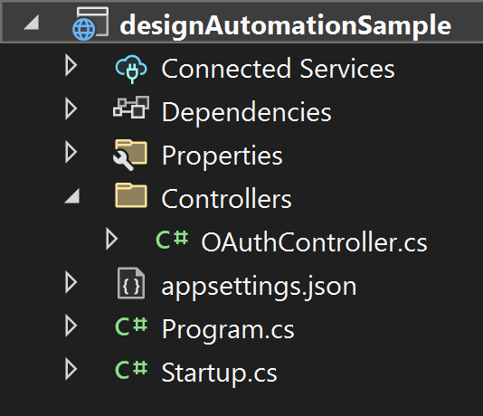
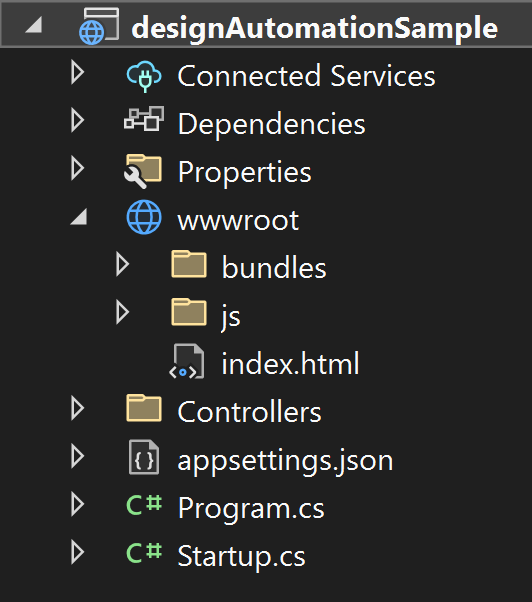
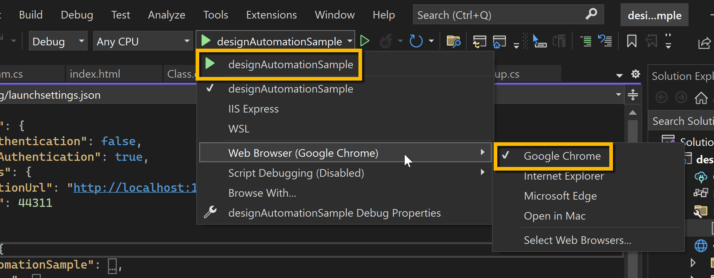
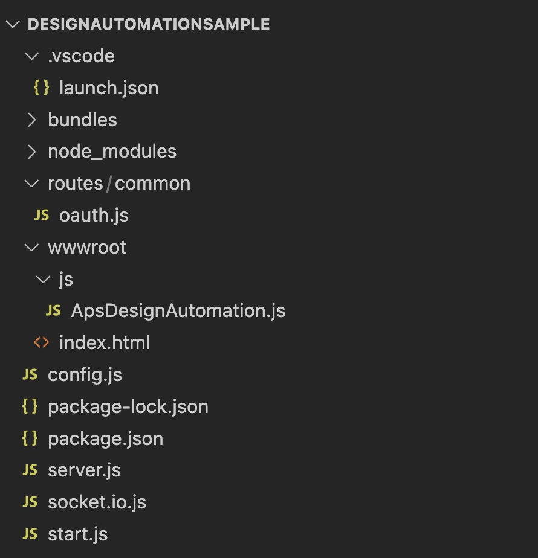

# 設計の自動化

- [設計の自動化](https://tutorials.autodesk.io/tutorials/design-automation)
- [Design Automation API サンプル](https://adndevblog.typepad.com/technology_perspective/2022/08/design-automation-api-sample.html)

## 紹介
このチュートリアルでは、入力ファイルをアップロードし、その and パラメーターを変更して、出力ファイルを保存できる Web アプリを作成する方法について説明します。UI では、AppBundle と Activity を (初期設定として) 定義し、Workitems を実行し、結果を出力することができます。`width` `height`

> 入力ファイルと出力ファイルはどちらも OSS バケットに保存され、Simple Viewer チュートリアルを使用して表示できます。


モデルを変更するには、次の手順が必要です。
サーバーを作成する << 初めての開発者ですか?ここから始める必要があります

- 基本的なアプリ UI
- プラグインを準備する
- アクティビティの定義
- 作業項目の実行

> **先端** このサンプルの完全な実装は、GitHub で入手できます。
>
> Node.jsの場合:https://github.com/autodesk-platform-services/aps-design-automation-nodejs
>
> .NET の場合: https://github.com/autodesk-platform-services/aps-design-automation-dotnet

## サーバーの作成

あなたの&は保護され、すべてのファイルがあなたのアカウントにバインドされるため、機密性を保つ必要があります。Web アプリケーションの場合は、サーバー上に保持します。このセクションでは、ローカル開発サーバーを準備する方法、作成方法について説明します。`Client ID` `Secret`

必要なソフトウェアについては、「環境設定」セクションを確認してください。

### プロジェクトのセットアップ

- Visual Studio 2022 を起動し、`Create New Project`
- テンプレート検索バーに入力します。[次へ] を選択して選択します。`ASP.NET Core Empty`
- 次のダイアログで、名前を付けましょう 、次へ。`designAutomationSample`
- 次のダイアログで、[.NET 6.0 (Long Term Support)] が選択されていることを確認し、チェックを外します。`Configure for HTTPS`
- チェックボックスをオンにして最上位レベルのステートメントの使用を無効にし、 をクリックします。`Do not use top-level statementscreate`
- Autodesk Forge NuGet パッケージをインストールするには、プロジェクト(ソリューション エクスプローラ)を右クリックし、[NuGet パッケージを管理]を選択して、[参照]で Autodesk.Forge を検索し、Autodesk.Forge をインストールします。これは、入力と出力の結果を OSS バケットにアップロードするために使用されます。
- 次のパッケージの .NET 6 互換バージョンもインストールしてください。

> **手記** 
> 
> このドキュメントの執筆時点では、チュートリアルではパッケージ名の横に指定されたバージョンを使用しています

```
Autodesk.Forge v1.9.7
Autodesk.Forge.DesignAutomation v5.1.1
Microsoft.AspNetCore.Mvc.NewtonsoftJson v6.0.16
Microsoft.AspNetCore.SignalR.Protocols.NewtonsoftJson v6.0.16
```


### アプリケーション構成
ソリューション エクスプローラーで、 の下にある [プロジェクト] を選択します。 を選択して開きます。`designAutomationSample` `Properties` `launchSettings.json`

- `applicationUrl`を「http://localhost:8080」に変更します
- go内で次の環境を追加します。`launchSettings.json` `profiles\designAutomationSample\environmentVariables`

```
ASPNETCORE_URLS:"http://localhost:8080"
APS_CLIENT_ID:"Your Id Here"
APS_CLIENT_SECRET:"Your Secret Here"
```

- プロジェクトを選択し、右クリックして > を選択し、 を選択します。`designAutomationSample` `Add` `New Item` `JSON`
- 名前を `.appsettings.user.json`
- [DesignAutomation SDK](https://www.nuget.org/packages/Autodesk.Forge.DesignAutomation) が oAuth を作成し、API リクエストを実行するために必要である、以下の設定を追加します。

```c#:appsettings.user.json
{
  "Forge": {
    "ClientId": "your client id",
    "ClientSecret": "your secret"
  }
}
```

これはローカルで実行されているため、0に設定されます。以下のようになります。`sslPort`

```c#:launchSettings.json
{
  "iisSettings": {
    "windowsAuthentication": false,
    "anonymousAuthentication": true,
    "iisExpress": {
      "applicationUrl": "http://localhost:8080",
      "sslPort": 0
    }
  },
  "profiles": {
    "designAutomationSample": {
      "commandName": "Project",
      "dotnetRunMessages": true,
      "launchBrowser": true,
      "applicationUrl": "http://localhost:8080",
      "environmentVariables": {
        "ASPNETCORE_ENVIRONMENT": "Development",
        "APS_CLIENT_ID": "your client id here",
        "APS_CLIENT_SECRET": "your secret here"
      }
    },
    "IIS Express": {
      "commandName": "IISExpress",
      "launchBrowser": true,
      "environmentVariables": {
        "ASPNETCORE_ENVIRONMENT": "Development"
      }
    }
  }
}
```
### サーバーのセットアップ

次に、Program.csを開き、次の名前空間を追加します

```c#
using Autodesk.Forge.Core;
using Autodesk.Forge.DesignAutomation;

```

次に、コンテンツを次のように置き換えます。これにより、上記で定義した環境変数から Forge Client ID と Secret をロードするようにアプリケーションに指示します。`Program.cs`

```c#
using Autodesk.Forge.Core;
using Autodesk.Forge.DesignAutomation;
using Microsoft.AspNetCore;

namespace designAutomationSample
{
    public class Program
    {
        public static void Main(string[] args)
        {
            CreateHostBuilder(args).ConfigureAppConfiguration(builder =>
            {
                builder.AddJsonFile($"appsettings.user.json", optional: true);
                builder.AddEnvironmentVariables();

            }).ConfigureServices((hostContext, services) =>
            {
                services.AddDesignAutomation(hostContext.Configuration);
            }).Build().Run();
        }

        public static IWebHostBuilder CreateHostBuilder(string[] args) =>
            WebHost.CreateDefaultBuilder(args)
                .UseStartup<Startup>();
    }
}
```

次に、Startup.csを開き(必要に応じて作成し)、次の名前空間を追加します

```c#
using Microsoft.AspNetCore.Mvc;

```

次に、Startup クラスの内容を次のコードに置き換えて、クライアントへの通知のプッシュに使用される静的ファイル サーバー (HTML と JS) と SignalR を有効にします。

```c#
// This method gets called by the runtime. Use this method to add services to the container.
// For more information on how to configure your application, visit https://go.microsoft.com/fwlink/?LinkID=398940
public void ConfigureServices(IServiceCollection services)
{
    services.AddMvc(options => options.EnableEndpointRouting = false).SetCompatibilityVersion(CompatibilityVersion.Version_3_0).AddNewtonsoftJson();
    services.AddSignalR().AddNewtonsoftJsonProtocol(opt=> {
        opt.PayloadSerializerSettings.ReferenceLoopHandling = Newtonsoft.Json.ReferenceLoopHandling.Ignore;
    });
}

// This method gets called by the runtime. Use this method to configure the HTTP request pipeline.
public void Configure(IApplicationBuilder app, IWebHostEnvironment env)
{
    app.UseFileServer();
    app.UseMvc();
}
```

### OAuthController.cs

WebAPI コントローラーをホストする Controllers フォルダーを作成します。 入力ファイルと出力ファイルを OSS バケットに読み書きする必要があります。[Controllers] フォルダーで、次の内容のファイルを作成します。`access token` `OAuthController.cs`

```c#:OAuthController.cs
using System;
using System.Collections.Generic;
using System.Linq;
using System.Threading.Tasks;
using Microsoft.AspNetCore.Mvc;
using Autodesk.Forge;

namespace designAutomationSample.Controllers
{
    [ApiController]
    public class OAuthController : ControllerBase
    {
        // As both internal & public tokens are used for all visitors
        // we don't need to request a new token on every request, so let's
        // cache them using static variables. Note we still need to refresh
        // them after the expires_in time (in seconds)
        private static dynamic InternalToken { get; set; }

        /// <summary>
        /// Get access token with internal (write) scope
        /// </summary>
        public static async Task<dynamic> GetInternalAsync()
        {
            if (InternalToken == null || InternalToken.ExpiresAt < DateTime.UtcNow)
            {
                InternalToken = await Get2LeggedTokenAsync(new Scope[] { Scope.BucketCreate, Scope.BucketRead, Scope.BucketDelete, Scope.DataRead, Scope.DataWrite, Scope.DataCreate, Scope.CodeAll });
                InternalToken.ExpiresAt = DateTime.UtcNow.AddSeconds(InternalToken.expires_in);
            }

            return InternalToken;
        }

        /// <summary>
        /// Get the access token from Autodesk
        /// </summary>
        private static async Task<dynamic> Get2LeggedTokenAsync(Scope[] scopes)
        {
            TwoLeggedApi oauth = new TwoLeggedApi();
            string grantType = "client_credentials";
            dynamic bearer = await oauth.AuthenticateAsync(
              GetAppSetting("APS_CLIENT_ID"),
              GetAppSetting("APS_CLIENT_SECRET"),
              grantType,
              scopes);
            return bearer;
        }

        /// <summary>
        /// Reads appsettings from web.config
        /// </summary>
        public static string GetAppSetting(string settingKey)
        {
            return Environment.GetEnvironmentVariable(settingKey).Trim();
        }
    }
}
```

プロジェクトの準備ができました!この時点で、次のようになります。



## 基本的なUI

インターフェイスは、バニラ HTML5 と に基づいています。基本的にはどのサーバー側でも同じですが、いくつかの違いがあります。 Websocketの実装では、socket.io()またはSignalR()を使用します。 UI ( と ) ファイルから始めましょう。フォルダーの下に、次の内容のファイルを作成します。`JavaScript` `Node.js` `.NET 6` `HTML` `JavaScript` `wwwroot` `index.html`

```html:index.html
<!DOCTYPE html>
<html>
  <head>
    <title>APS - Design Automation</title>
    <meta charset="utf-8" />
    <link rel="shortcut icon" href="https://cdn.autodesk.io/favicon.ico" />
    <!-- Common packages: jQuery, Bootstrap -->
    <script src="//cdnjs.cloudflare.com/ajax/libs/jquery/3.3.1/jquery.min.js"></script>
    <script src="//cdnjs.cloudflare.com/ajax/libs/twitter-bootstrap/3.4.1/js/bootstrap.min.js"></script>
    <link
      rel="stylesheet"
      href="//cdnjs.cloudflare.com/ajax/libs/twitter-bootstrap/3.4.1/css/bootstrap.min.css"
    />
    <!-- .NET SignalR -->
    <script src="https://cdnjs.cloudflare.com/ajax/libs/microsoft-signalr/3.1.7/signalr.min.js"></script>
    <!-- Files for this project -->
    <script src="/js/ApsDesignAutomation.js"></script>
  </head>

  <body style="height: 100%;">
    <!-- Fixed navbar by Bootstrap: https://getbootstrap.com/examples/navbar-fixed-top/ -->
    <nav class="navbar navbar-default navbar-fixed-top">
      <div class="container-fluid">
        <ul class="nav navbar-nav left">
          <li>
            <a href="http://tutorials.autodesk.io" target="_blank">
              
            </a>
          </li>
        </ul>
        <div style="float: right; margin-top: 15px; cursor: pointer;">
          <span
            style="padding-right: 5px;"
            data-toggle="modal"
            data-target="#defineActivityModal"
            title="Configura AppBundle & Activity"
          >
            <span class="glyphicon glyphicon-cog glyphiconTop mlink"> </span>
            Configure
          </span>
        </div>
      </div>
    </nav>
    <!-- End of navbar -->
    <div class="container-fluid" style="margin-top: 70px;">
      <div class="row">
        <div class="col-sm-4">
          <div class="form-group">
            <label for="width">Width:</label>
            <input
              type="number"
              class="form-control"
              id="width"
              placeholder="Enter new width value"
            />
          </div>
          <div class="form-group">
            <label for="height">Height:</label>
            <input
              type="number"
              class="form-control"
              id="height"
              placeholder="Enter new height value"
            />
          </div>

          <div class="form-group">
            <label for="inputFile">Input file</label>
            <input type="file" class="form-control-file" id="inputFile" />
          </div>
          <div class="form-group">
            <label for="activity">Existing activities</label>
            <select class="form-control" id="activity"></select>
          </div>
          <center>
            <button class="btn btn-primary" id="startWorkitem">
              Start workitem
            </button>
          </center>
          <br />
        </div>
        <div class="col-sm-8">
          <pre
            id="outputlog"
            style="height: calc(100vh - 120px);; overflow-y: scroll;"
          ></pre>
        </div>
      </div>
    </div>
    <!-- Modal Define AppBundle & Activity -->
    <div
      class="modal fade"
      id="defineActivityModal"
      tabindex="-1"
      role="dialog"
      aria-labelledby="myModalLabel"
    >
      <div class="modal-dialog" role="document">
        <div class="modal-content">
          <div class="modal-header">
            <button
              type="button"
              class="close"
              data-dismiss="modal"
              aria-label="Cancel"
            >
              <span aria-hidden="true">&times;</span>
            </button>
            <h4 class="modal-title" id="myModalLabel">
              Create/Update AppBundle & Activity
            </h4>
          </div>
          <div class="modal-body">
            <div class="alert alert-warning">
              <center>
                You just need to define AppBundle &amp; Activity once.<br />If
                the plugin code changed, redefine (creates a new version).
              </center>
            </div>
            <div class="form-group">
              <label for="localBundles">Select a local AppBundle:</label>
              <select class="form-control" id="localBundles"></select>
              <b>Tip:</b> Make sure .ZIP bundles are placed at
              <b>/bundles/</b> folder
            </div>
            <div class="form-group">
              <label for="engines">Select engine:</label>
              <select class="form-control" id="engines"></select>
            </div>
            For this sample the .ZIP name is used as suffix to define
            <b>AppBundle</b> and <b>Activity</b>
            names. Activities will have file and params input, and file output.
          </div>
          <div class="modal-footer">
            <button class="btn btn-danger" id="clearAccount">
              Clear account
            </button>
            <button
              type="button"
              class="btn btn-primary"
              id="createAppBundleActivity"
            >
              Create/Update
            </button>
          </div>
        </div>
      </div>
    </div>
  </body>
</html>
```

### ApsDesignAutomation.js

フォルダの下にフォルダを作成します。次に、フォルダー内に、次の内容のファイルを作成します。`js` `wwwroot` `wwwroot/js` `ApsDesignAutomation.js`

```js:ApsDesignAutomation.js
$(document).ready(function () {
  prepareLists();

  $("#clearAccount").click(clearAccount);
  $("#defineActivityShow").click(defineActivityModal);
  $("#createAppBundleActivity").click(createAppBundleActivity);
  $("#startWorkitem").click(startWorkitem);

  startConnection();
});

function prepareLists() {
  list("activity", "/api/aps/designautomation/activities");
  list("engines", "/api/aps/designautomation/engines");
  list("localBundles", "/api/appbundles");
}

function list(control, endpoint) {
  $("#" + control)
    .find("option")
    .remove()
    .end();
  jQuery.ajax({
    url: endpoint,
    success: function (list) {
      if (list.length === 0)
        $("#" + control).append(
          $("<option>", { disabled: true, text: "Nothing found" })
        );
      else
        list.forEach(function (item) {
          $("#" + control).append($("<option>", { value: item, text: item }));
        });
    },
  });
}

function clearAccount() {
  if (
    !confirm(
      "Clear existing activities & appbundles before start. " +
        "This is useful if you believe there are wrong settings on your account." +
        "\n\nYou cannot undo this operation. Proceed?"
    )
  )
    return;

  jQuery.ajax({
    url: "api/aps/designautomation/account",
    method: "DELETE",
    success: function () {
      prepareLists();
      writeLog("Account cleared, all appbundles & activities deleted");
    },
  });
}

function defineActivityModal() {
  $("#defineActivityModal").modal();
}

function createAppBundleActivity() {
  startConnection(function () {
    writeLog("Defining appbundle and activity for " + $("#engines").val());
    $("#defineActivityModal").modal("toggle");
    createAppBundle(function () {
      createActivity(function () {
        prepareLists();
      });
    });
  });
}

function createAppBundle(cb) {
  jQuery.ajax({
    url: "api/aps/designautomation/appbundles",
    method: "POST",
    contentType: "application/json",
    data: JSON.stringify({
      zipFileName: $("#localBundles").val(),
      engine: $("#engines").val(),
    }),
    success: function (res) {
      writeLog("AppBundle: " + res.appBundle + ", v" + res.version);
      if (cb) cb();
    },
  });
}

function createActivity(cb) {
  jQuery.ajax({
    url: "api/aps/designautomation/activities",
    method: "POST",
    contentType: "application/json",
    data: JSON.stringify({
      zipFileName: $("#localBundles").val(),
      engine: $("#engines").val(),
    }),
    success: function (res) {
      writeLog("Activity: " + res.activity);
      if (cb) cb();
    },
  });
}

function startWorkitem() {
  var inputFileField = document.getElementById("inputFile");
  if (inputFileField.files.length === 0) {
    alert("Please select an input file");
    return;
  }
  if ($("#activity").val() === null) {
    alert("Please select an activity");
    return;
  }
  var file = inputFileField.files[0];
  startConnection(function () {
    var formData = new FormData();
    formData.append("inputFile", file);
    formData.append(
      "data",
      JSON.stringify({
        width: $("#width").val(),
        height: $("#height").val(),
        activityName: $("#activity").val(),
        browserConnectionId: connectionId,
      })
    );
    writeLog("Uploading input file...");
    $.ajax({
      url: "api/aps/designautomation/workitems",
      data: formData,
      processData: false,
      contentType: false,
      type: "POST",
      success: function (res) {
        writeLog("Workitem started: " + res.workItemId);
      },
    });
  });
}

function writeLog(text) {
  $("#outputlog").append(
    '<div style="border-top: 1px dashed #C0C0C0">' + text + "</div>"
  );
  var elem = document.getElementById("outputlog");
  elem.scrollTop = elem.scrollHeight;
}

var connection;
var connectionId;

function startConnection(onReady) {
  if (connection && connection.connectionState) {
    if (onReady) onReady();
    return;
  }
  connection = new signalR.HubConnectionBuilder()
    .withUrl("/api/signalr/designautomation")
    .build();
  connection.start().then(function () {
    connection.invoke("getConnectionId").then(function (id) {
      connectionId = id; // we'll need this...
      if (onReady) onReady();
    });
  });

  connection.on("downloadResult", function (url) {
    writeLog('<a href="' + url + '">Download result file here</a>');
  });

  connection.on("onComplete", function (message) {
    writeLog(message);
  });
}
```

最終結果は次のようになります



この時点で、プロジェクトを実行し、再生を押すだけで、HTMLインターフェイスが開き、プロジェクトが正しく作成されたことが示されます。どのボタンも機能しないはずです...先に進みましょう。



## プラグインを作成

Design Automation は [Autodesk App Store](https://www.autodesk.com/developer-network/app-store) と同様に使用するため、DLL (およびその他の必要なファイル)を含む PackageContents.xml と ZIP を作成する必要があります。作成方法の詳細については、Autodesk App Store デベロッパー センターを参照してください。`.bundle`

このセクションでは、幅と高さのパラメータを更新し、結果のファイルを保存する基本的なプラグインを作成します。また、サポート ファイル (PackageContents.xml) とそれらを配置するフォルダー構造。最後に、Design Automation にアップロードする準備ができている .ZIP ファイルを作成します。

ルートフォルダにフォルダを作成します。`bundles`



### 前提 条件

- 7zip:バンドルファイルで.ZIPを作成する場合は、こちらからインストールしてください。このチュートリアルでは、7zip が既定のフォルダー にインストールされていることを前提としています。`C:\Program Files\7-Zip\7z.exe`

### 追加の前提条件

次のセッションでは、ビルド前のプラグインを使用できます。または、それを構築することにした場合は、

- Visual Studio: Visual Studio 2019 以降が必要です。
- [AutoCAD](https://www.autodesk.com/products/autocad/overview?term=1-YEAR&tab=subscription)、[Inventor](https://www.autodesk.com/products/inventor/overview?term=1-YEAR&tab=subscription)、[Revit](https://www.autodesk.com/products/inventor/overview?term=1-YEAR&tab=subscription)、または [3ds Max](https://www.autodesk.com/products/inventor/overview?term=1-YEAR&tab=subscription): Design Automation プラグインの開発、テスト、デバッグ: AutoCAD |発明者 |Revitの |3ds Maxの

---

次の手順では、プラグインを実行するオートデスク アプリケーションであるエンジンを選択します。ローカルでコンパイル、デバッグ、テストするには、それぞれのアプリケーションをインストールする必要があります。

### エンジンを選択
